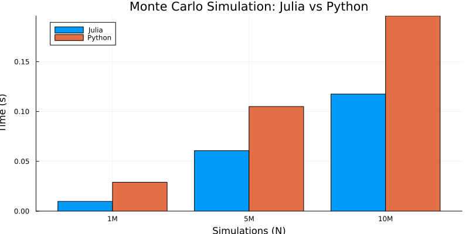

# Monte Carlo Benchmark: Julia vs Python

This repo contains a small benchmarking experiment comparing **Julia and Python** for a CPU-bound numerical task. The focus isn't on the accuracy of the simulation itself - it’s on how each language performs under a straightforward, repeatable workload.

The simulation estimates the price of a European call option using a **Monte Carlo method** under the Black-Scholes model. It’s a classic benchmark scenario: compute-heavy, easy to scale, and easy to implement in both languages.

## Purpose

This started as an excuse to explore Julia a bit more seriously. I'm not working on anything involving option pricing or Monte Carlo simulations in my day job - I just wanted a simple way to stress-test performance with minimal boilerplate.

## Setup

- **Julia version:** 1.11  
- **Python version:** 3.11 + NumPy  
- **Simulation sizes:** 1M, 5M, 10M iterations

## Results

| Simulations | Python Time (s) | Julia Time (s) | Speedup |
|-------------|------------------|----------------|---------|
| 1 million   | 0.029            | 0.010          | ~2.9x   |
| 5 million   | 0.105            | 0.092          | ~1.14x  |
| 10 million  | 0.196            | 0.117          | ~1.67x  |

Chart output:



## Takeaways

Julia was consistently faster than Python for this workload - nearly 3x faster at the lower end, and still ahead at larger scales. These aren’t scientific measurements and they weren’t intended to be, but they do line up with the general performance reputation Julia has earned.

Most of the benchmarking logic was simple to write. Most of the effort went into getting the plotting to behave.

## How to Run

### Julia

```
julia --project scripts/run_simulation.jl
```

### Python

```
python -m venv venv
source venv/bin/activate      # Or .\venv\Scripts\activate on Windows
pip install numpy
python scripts/run_python_benchmark.py
```

## What's in the Repo

```
montecarlo-julia-poc/
├── src/                    # MonteCarlo.jl simulation logic
├── scripts/                # Runners for both Julia and Python
├── plots/                  # Output PNG of the comparison chart
├── benchmarks/             # Placeholder for future output
├── Project.toml            # Julia environment
├── README.md
└── .gitignore
```

## License

MIT - feel free to use or extend.
